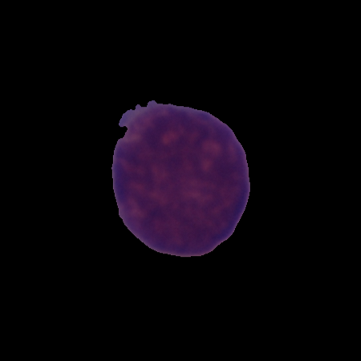

# Blood Cell Image Classifier

This project is motivated by a free data set that I found online from the IEEE Biomedical Society, it contains very hard to distinguish image samples of cancer and healthy cells. In this project I hope to build a machine learning model that can accurately classify such images. I want to use both Google's Tensorflow API and the teachable machine website (MobileNet) for quick and easy deployment.

## Demo
[Python Notebook](https://colab.research.google.com/drive/1_OWkGEKsQ-966SutA3tQFFm2tUMgIHV-)

## Packages
- Tensorflow (TF) / TF Keras API
- [Teachable Machine](https://teachablemachine.withgoogle.com/)
- Google Cloud AI & ML


## Installation

```
pip install virtualenv

pip install tensorflow

virtualenv tf_leuk

env\scripts\activate

pip install -r requirements.txt
```

For whatever reason GitHub kept telling me that Pillow had a vulnerability issue so please install pillow separately.

```
pip install Pillow
```

## Results
So far the results of the image classifier are not very satisfactory, mainly due to the fact the model was trained on a MobileNet of non-medical related images. As a result of this, I plan to build and train the model as I read the tensorflow documentation; although I was really hoping to use the Teachable Machine website since deployment would have been very easy.

Nonetheless, here is an image of a cancerous cell and its respective prediction.

<p align=center>
  
</p>
<p align=center>
  <b>Figure 1.</b> Microscope image  of a malignant B-ALL white blood cancer cell (ground truth attained by expert pathologist)
</p>

```
[[% of healthy cell,  % of cancer cell]]
[[0.54169554 0.45830446]]
[Finished in 29.738s]
```

As you can tell from the output of the prediction, the model does not work as well as I would have hoped it to. This simply means that I must retrain it on more data, with maybe even a better machine learning model.

If you wish to use the code yourself, please refer to main.py for some of the actual demo code or you can look at the python notebook that I linked above. If you get any good results, please open a discussion or issue and let me know; I would be very excited to see this simple model work well.

## Contributing
Pull requests are welcome. For major changes, please open an issue first to discuss what you would like to change.

Please make sure to update tests as appropriate.

## License
[MIT](https://choosealicense.com/licenses/mit/)
